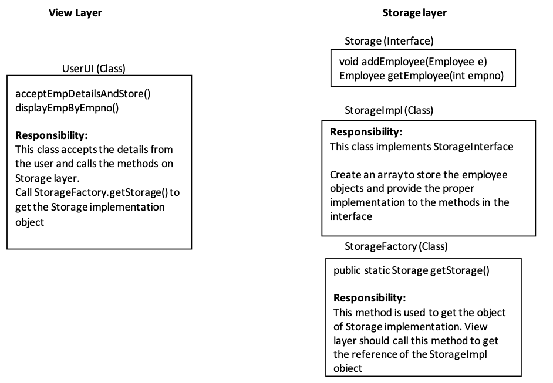

:keyboard: **LAB 4**  

1) Override showDetails() method in the SpecialMovie and InternationalMovie (created in previous assignment) to display the details of additional fields.

2) Create an array of Movie class and store Objects of Movie, SpecialMovie and InternationalMovie classes in the array.

3) Using a single for loop traverse the above array and call the method showDetails() on all the objects of the array. Correlate this with your knowledge of runtime polymorphism.

4) Check whether it is possible to call the methods of SpecialMovie and InternationalMovie while traversing the array inside the for loop. If not, use typecasting to do this.

5) Come up with your own example to demonstrate the following concepts 
  - Creation of Interfaces
  - Creation of interfaces by extending other interfaces
  - Creation of class by extending another class and implementing multiple interfaces
  - Creation of reference variable of an interface.
  - Creation of a class that implements above interface.
  - Store an object of class created in step e in the reference variable of the interface created in step d.
  - Call the methods of the object using interface reference variable

6) A Java application with multiple layers is responsible for managing details of Employees. The view layer is responsible for user interaction and only accepts or displays details from/to user. View layer will communicate with storage layer for all CRUD operations. Develop the application based on the below class structure. Class structures, method information and responsibilities of each class are given below. Create a main class to test your application.
  - The entity class Employee contains emp no, first name, last name, city & salary attributes.

