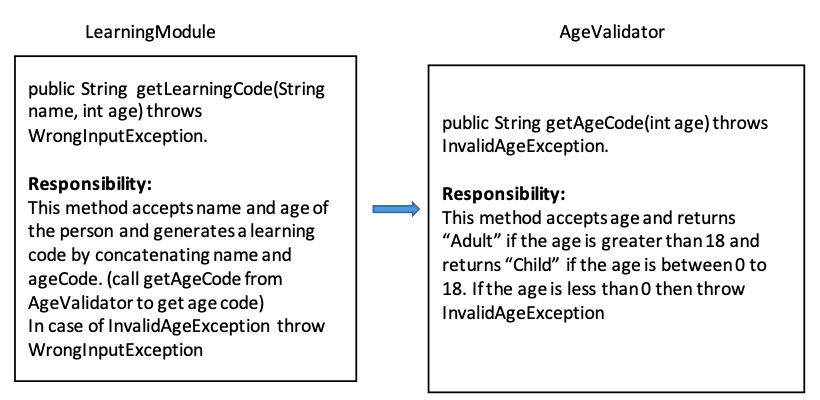
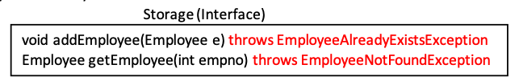

:keyboard: **LAB 5**  

1) Test the below concepts by writing necessary classes and methods:
  - Single try.. catch.. finally block
  - Multiple catch blocks
  - Nested try-catch blocks
  - Usage of throw and throws keywords

2) Create a checked exception InvalidAgeException. Override all the constructors from the super class

3) Create a RuntimeException WrongInputException. Override all the constructors from the super class

4) Create the below two classes. LearningModule class is dependent on AgeValidator class to check whether the age is valid or not.

   
   
   Create the Main class for accepting the data from the user and call the methods on LearningModule object. In case of any exceptions catch the exception and display the appropriate message to the user.

5) Modify the interface definition as follows

  
  
  - While adding the employee if the employee with the same id already exists in the array Raise EmployeeAlreadyExistsException
  
  - While Searching if the Employee with the given empno is not found in the array then raise EmployeeNotFoundException. 
  
  - Create the required exceptions and modify any other classes accordingly.  
